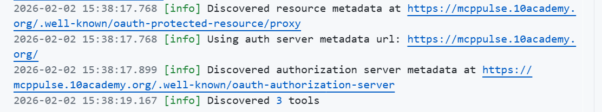

# MCP-Challenge

This project explores how to configure and improve an MCP server and its coding agent using custom rules. Inspired by Boris Cherny’s Claude Code workflow and community best practices, the goal is to create a safer, more effective agent that supports debugging, feature building, and iterative development.

## Steps taken

- Installed and configured MCP server in the development environment.
- Experimental dependencies listed generated by agent in `requirements.txt`.
- Verified server runs locally with sample tasks. 
- Referenced Boris Cherny’s workflow thread on X (Claude Code setup) and community best practices for AI coding agents followed by personalization for my personal usage by adding where I face obstacle.

**What I did:**

I added two sets of instructions to the .github/copilot-instructions.md file. The first set of rules empahsize on asking for user confirmation before accepting any commit or merge request. The second set of rules are generalised rules to improve the AI agent's performance and interaction quality like explaining errors, citing sources, maintaining a professional tone, clarifying ambiguities, and suggesting code optimizations.

**What worked:**

While trying to understand the agent I have discovered ways to improve ways to update dependency file by its own.The agent was able to understand the rules and followed them to some extent.

**What didn't work:**

From my personal expereince I make mistakes while commitiing when I am in a hurry and reversing it is a hastle. So, I have tried to add rules to avoid such mistakes by asking for user confirmation before accepting any commit or merge request. However, this did not work as expected. The agent still accepted the first commit or merge request without asking for confirmation.

**What I hope to improve:**

I hope to improve the commit and merge request handling by making the agent more strict about asking for user confirmation before accepting any commit or merge request. I will try to refine the rules further and test them again to see if they work as intended.
